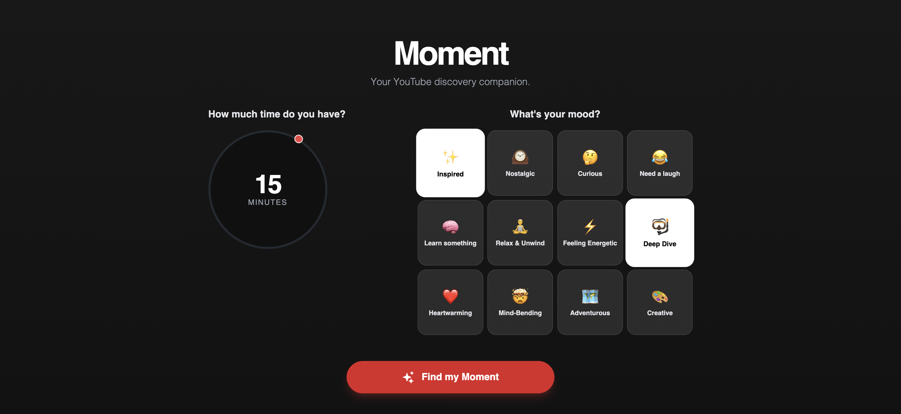

# 🎬 Moment - YouTube Discovery Companion

A smart YouTube video discovery app powered by Gemini AI and YouTube Data API. Find the perfect video for your mood and available time, eliminating decision paralysis with curated, personalized recommendations.

## 🌐 Live Demo

**[Try it live →](https://adamfaik.github.io/youtube-moment/)**

## 📸 Screenshot



## ✨ Features

- **Mood-Based Discovery**: Select your current mood and get personalized video recommendations
- **Time-Aware Suggestions**: Choose your available time (5 min to 2 hours) and get perfectly timed videos
- **AI-Powered Curation**: Uses Gemini AI to select the best "hidden gem" videos, not just viral hits
- **Real-Time Validation**: All videos are validated through YouTube API to ensure they exist and are accessible
- **Beautiful UI**: Modern, dark-themed interface with smooth animations

## 🚀 Quick Start

### Prerequisites

- Node.js (v18 or higher recommended)
- Gemini API key ([Get one here](https://aistudio.google.com/apikey))
- YouTube Data API v3 key ([Get one here](https://console.cloud.google.com/))

### Installation

1. **Clone the repository**
   ```bash
   git clone https://github.com/adamfaik/youtube-moment.git
   cd youtube-moment
   ```

2. **Install dependencies**
   ```bash
   npm install
   ```

3. **Set up environment variables**
   
   Create a `.env.local` file in the root directory:
   ```env
   GEMINI_API_KEY=your_gemini_api_key_here
   YOUTUBE_API_KEY=your_youtube_api_key_here
   ```

4. **Run the development server**
   ```bash
   npm run dev
   ```

5. **Open your browser**
   
   Navigate to `http://localhost:3000`

## 🛠️ Available Scripts

- `npm run dev` - Start development server
- `npm run build` - Build for production
- `npm run preview` - Preview production build locally
- `npm run deploy` - Deploy to GitHub Pages

## 🏗️ How It Works

1. **User Input**: Select your available time and current mood(s)
2. **YouTube Search**: The app searches YouTube for real videos matching your preferences
3. **Duration Filtering**: Results are filtered to match your time requirement
4. **AI Selection**: Gemini AI analyzes the candidates and selects the perfect match
5. **Validation**: The selected video is validated through YouTube API
6. **Display**: You get a curated video with tags and a compelling summary

## 🎯 Tech Stack

- **React 19** - UI framework
- **TypeScript** - Type safety
- **Vite** - Build tool and dev server
- **Gemini AI** - Video selection and content generation
- **YouTube Data API v3** - Video search and validation
- **Tailwind CSS** - Styling (via CDN)

## 📦 Project Structure

```
youtube-moment/
├── components/          # React components
│   ├── icons/          # Icon components
│   ├── MoodSelector.tsx
│   ├── SuggestionCard.tsx
│   └── TimeSelector.tsx
├── services/           # API services
│   ├── geminiService.ts    # Gemini AI integration
│   └── youtubeService.ts   # YouTube API integration
├── docs/               # Documentation assets
├── App.tsx             # Main app component
├── types.ts            # TypeScript type definitions
└── vite.config.ts      # Vite configuration
```

## 🔒 Security Notes

⚠️ **Important**: This app uses API keys in the client-side code. For production use, consider:

- Restricting API keys in Google Cloud Console to specific domains
- Using a backend proxy to keep API keys server-side
- Using separate API keys for production (not your main keys)

## 🚢 Deployment

This app is deployed to GitHub Pages using GitHub Actions. The deployment workflow:

1. Automatically builds the app on push to `main` branch
2. Uses GitHub Secrets for API keys
3. Deploys to `https://adamfaik.github.io/youtube-moment/`

See `.github/workflows/deploy.yml` for the deployment configuration.

## 📝 License

This project is private and not licensed for public use.

## 🤝 Contributing

This is a personal project, but suggestions and feedback are welcome!

## 📧 Contact

For questions or suggestions, please open an issue on GitHub.

---

**Built with ❤️ using React, TypeScript, and AI**
